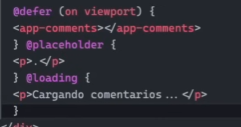

# Angular

Lista de reproducción del curso

https://www.youtube.com/watch?v=f7unUpshmpA&t


Instalar angular

```
npm install -g @angular/cli
```
Crear app

```
ng new my-app
```
```
cd my-app
```
```
npm start
```

## Componente

Para generar un componente

```
ng g c nombre
```

Si queres ponerlo en una carpeta ya creada y sin el test

```
ng g c carpeta/nombre --no-spec
```

## Standalone

En app-root si queremos importar un componente simplemente en imports lo agregamos por ejemplo agregamos nuestro HeaderComponent

```js
import { Component } from '@angular/core';
import { RouterOutlet } from '@angular/router';
import { HeaderComponent } from './components/header/header.component';

@Component({
  selector: 'app-root',
  standalone: true,
  imports: [RouterOutlet, HeaderComponent],
  templateUrl: './app.component.html',
  styleUrl: './app.component.css'
})
export class AppComponent {
  title = 'my-app';
}
```
## Propiedades

En el html podemos interpolr con {{ algo }} y ademas ejecutar codigo javascript dentro de las llaves como por ejemplo el upperCase()

```js
<header>

<nav><a href="#">Home</a></nav>

<p>Esto es una propiedad: {{ propiedad.toUpperCase() }} </p>

</header>
```

En nuestro controlador

```js
import { Component } from '@angular/core';

@Component({
  selector: 'app-header',
  standalone: true,
  imports: [],
  templateUrl: './header.component.html',
  styleUrl: './header.component.css'
})
export class HeaderComponent {

  propiedad = "Propiedad"
}
```


## Directivas

### If

Ver si el usuario tiene la  sesión iniciada o no.

```js
@if (isLoggedIn) {
    <p>Bienvenido! {{username}}</p>
} @else {
    <p>Iniciar sesión</p>
}
```
En nuestro controlador
```js
import { Component } from '@angular/core';

@Component({
  selector: 'app-user',
  standalone: true,
  imports: [],
  templateUrl: './user.component.html',
  styleUrl: './user.component.css'
})
export class UserComponent {

  username = 'Laureano'
  isLoggedIn = true
}
```
### For

En el track tenemos que poner cual es identificador unico de cada uno de los elementos.

En nuestro html

```js
@for (game of games; track game.id) {

    <li>{{game.name}}</li>
}
```

En nuestro controlador
```js
import { Component } from '@angular/core';

@Component({
  selector: 'app-game',
  standalone: true,
  imports: [],
  templateUrl: './game.component.html',
  styleUrl: './game.component.css'
})
export class GameComponent {

  games = [
    {
      id:1,
      name:'Bloodborne'
    },
    {
      id:2,
      name:'Horizon'
    },
    {
      id:3,
      name:'Sekiro'
    }
  ]
}
```
## Binding

A diferencia de react que es one-data binding angular va hacia los dos. Le puedes pasar al padre información.

### Eventos

Creamos un manejador de evento llamado saludo() que emitirá un alert()

```js
import { Component } from '@angular/core';
import { RouterOutlet } from '@angular/router';
import { HeaderComponent } from './components/header/header.component';
import { UserComponent } from './components/user/user.component';
import { GameComponent } from './components/game/game.component';

@Component({
  selector: 'app-root',
  standalone: true,
  imports: [RouterOutlet, HeaderComponent, UserComponent, GameComponent],
  templateUrl: './app.component.html',
  styleUrl: './app.component.css'
})
export class AppComponent {
  saludo(){
    alert('Hola')
  }
}
```
Entre parentesis figura el evento y le asignamos un manejador.

```js

```

En nuestro user component

```js
@if (isLoggedIn) {
    <p>Bienvenido! {{username}}</p>
} @else {
    <p>Iniciar sesión</p>
}

<button (click)="isLoggedIn=true">Cambiar Estado</button>
```

Se renderiza solo el componente o toda la página? Solo el componente.

## Props, Comunicación entre componentes

### Input
El decorador @Input indica que al componente X se le puede pasar como input un username por ejemplo

```js
import { Component, Input } from '@angular/core';

@Component({
  selector: 'app-user',
  standalone: true,
  imports: [],
  templateUrl: './user.component.html',
  styleUrl: './user.component.css'
})
export class UserComponent {

  @Input() username = ''
  isLoggedIn = false
}
```

Luego en la llamada del componente

```js
<app-user username="Laureano"/>
```

### Output

Esta comunicación es más compleja, de hijo a padre. Por ejemplo clickear un elemento del hijo y avisar al padre de que se ha clickeado un elemento del hijo.

```js
@if (isLoggedIn) {
    <p>Bienvenido! {{username}}</p>
} @else {
    <p>Iniciar sesión</p>
}

<button (click)="isLoggedIn=!isLoggedIn">Cambiar Estado</button>


<li (click)="fav('Favorito desde el hijo')">Click para que el padre maneje el evento</li>
```
En el controlador

```js
import { Component, EventEmitter, Input, Output } from '@angular/core';

@Component({
  selector: 'app-user',
  standalone: true,
  imports: [],
  templateUrl: './user.component.html',
  styleUrl: './user.component.css'
})
export class UserComponent {

  @Input() username = ''
  isLoggedIn = false

  @Output() addFavoriteEvent = new EventEmitter<string>()

  fav(apellido:string){
    this.addFavoriteEvent.emit(apellido)
  }

}
```

Ahora nos falta la parte del padre en nuestro caso haremos desde app-root

```js
export class AppComponent {

  favorito = ''

  getFavorite(fav:string){
    this.favorito = fav 
  }
}
```

En la llamada del componente app-user

```js
<app-user username="Laureano"
(addFavoriteEvent)="getFavorite($event)"
/>
```

Para ver el cambio

```js
<app-header/>

<app-user username="Laureano"
(addFavoriteEvent)="getFavorite($event)"
/>
<app-game/>

@if (favorito != '') {

    <p>Favorito: {{ favorito }}</p>
}


<router-outlet />

```

### @Difer

Sin el defer se carga toooooda la página. El defer hace una carga diferida cuando la cpu no tenga carga de trabajo. Es util si tenemos un texto super largo y las imagenes de abajo no se carguen al inicio. Con el loading ponemos un comentario hasta que se cargue el contenido.


```js
@defer (on viewport)
<app-component/>
```



## Servicios

Creamos una carpeta dentro de app llamada services. Utilizaremos https://fakestoreapi.com/products para acceder a todos los productos

En app.config vamos a configurar dentro de los providers los equivalentes a varios modulos. Ya tendriamos nuestro modulo httpclient al agregar provideHttpClient()

```js
import { ApplicationConfig } from '@angular/core';
import { provideRouter } from '@angular/router';

import { routes } from './app.routes';
import { provideHttpClient } from '@angular/common/http';

export const appConfig: ApplicationConfig = {
  providers: [provideRouter(routes),
    provideHttpClient()
  ]
};
```

Ejecutamos el siguiente comando para hacer un servicio.
```
ng g s services/producto
```
Y se nos genera

```js
import { Injectable } from '@angular/core';

@Injectable({
  providedIn: 'root'
})
export class ProductoService {

  constructor() { }
}
```

Modificamos el archivo en any iría una interfaz, y retornamos un observable.

```js
import { HttpClient } from '@angular/common/http';
import { Injectable, inject } from '@angular/core';
import { Observable } from 'rxjs';

@Injectable({
  providedIn: 'root'
})
export class ProductoService {

  private readonly _http = inject(HttpClient)

  getAllProducts():Observable<any>{
    return this._http.get('https://fakestoreapi.com/products')
  }
}
```

En nuestro componente product$ es un observable.

```js
import { Component, inject } from '@angular/core';
import { RouterOutlet } from '@angular/router';
import { HeaderComponent } from './components/header/header.component';
import { UserComponent } from './components/user/user.component';
import { GameComponent } from './components/game/game.component';
import { ProductoService } from './services/producto.service';

@Component({
  selector: 'app-root',
  standalone: true,
  imports: [RouterOutlet, HeaderComponent, UserComponent, GameComponent],
  templateUrl: './app.component.html',
  styleUrl: './app.component.css'
})
export class AppComponent {
 
  private readonly productService = inject(ProductoService)
  products$ = this.productService.getAllProducts()

}
```
Para utilizar el observable vamos al html

```js
<pre>{{products$ | async | json }}</pre>
```

Para que funcione se debe importar el modulo CommonModule dentro del componente el cual utilizará el servicio

```js
import { Component, inject } from '@angular/core';
import { RouterOutlet } from '@angular/router';
import { ProductoService } from './services/producto.service';

import { CommonModule } from '@angular/common'

@Component({
  selector: 'app-root',
  standalone: true,
  imports: [CommonModule, RouterOutlet],
  templateUrl: './app.component.html',
  styleUrl: './app.component.css'
})
export class AppComponent {
  private readonly productService = inject(ProductoService)
  products$ = this.productService.getAllProducts()
}

```

Por ultimo, por defecto angular utiliza el XMLHTTPRequest. Podemos utilizar el fetch nativo de js utilizando withFetch() en app.config.ts

```ts
import { ApplicationConfig } from '@angular/core';
import { provideRouter } from '@angular/router';

import { routes } from './app.routes';
import { provideHttpClient, withFetch } from '@angular/common/http';

export const appConfig: ApplicationConfig = {
  providers: [provideRouter(routes),
    provideHttpClient(withFetch())
  ]
};
```