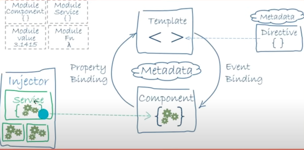
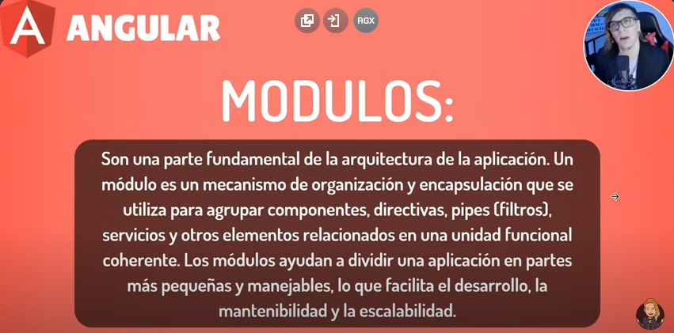
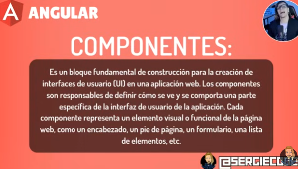
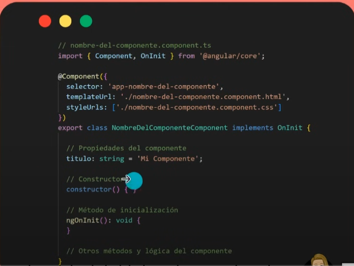
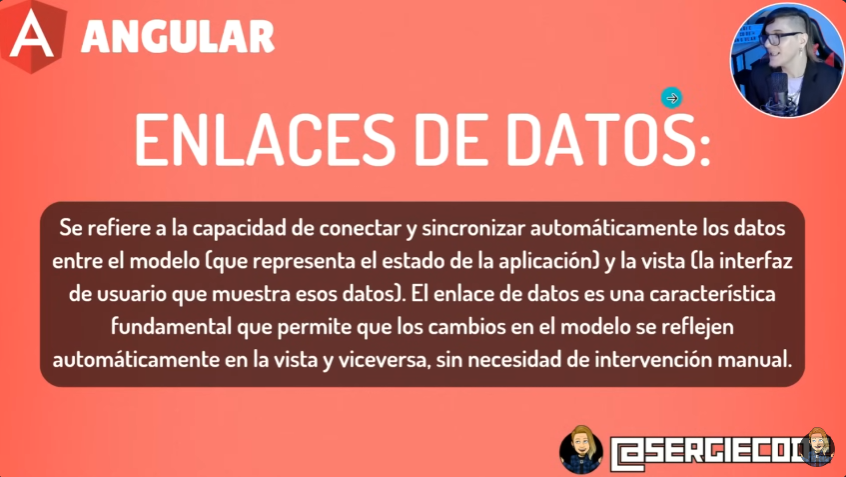

# Angular

Curso: https://www.youtube.com/watch?v=soInCF7nbDw&t=524s

## Crear una nueva app

Instalar angular
```
npm install -g @angular/cli
ng --version
```

Crear una nueva app
```
ng new my-app
```

**Crear una nueva app sin standalone para hacer el curso.**

Aparentemente la versión de Angular 16 no soporta la última versión LTS de NODE. Acá hay 2 opciones o instalamos una versión de NODE más vieja o Angular 17 y usamos --no-standalone 
Para poder hacer el curso necesitamos usar el ngModule por lo cual podés usar Angular 17 y agregarle --no-standalone a las creaciones de proyectos para que mantenga el módulo, de esta forma:


El --no-standalone te instalará el app.module.ts y el ngmodule al igual que se usaba en Angular 16 para atrás

Sino podemos usar Angular 16 con NODE 18!

```
ng new nombre-de-la-aplicación --no-standalone
```

Run `ng serve` for a dev server. Navigate to `http://localhost:4200/`. The application will automatically reload if you change any of the source files.
```
ng serve
```

En el archivo angular.json se encuentr la configuración del proyecto. Alli podremos ver donde se van a poner las imagenes estaticas por ejemplo en src/assets/ o donde vamos a poner un icono.

O un lugar donde poner nuestros estilos. O javascripts de terceros en scripts:[]

Todo lo que está dentro de source será nuestra App.

Assets es para archivos estaticos y app nuestras cositas, enruntamiento, modulos y componentes.

## Conceptos básicos



<li><b>Modulos</b></li>
<li><b>Componentes</b></li>
<li><b>Servicios</b></li>
<li><b>Dependencias</b></li>
<li><b>Plantillas</b></li>
<li><b>Directivas</b></li>
<li><b>Enrutamiento</b></li>
<li><b>Metadata</b></li>

## Modulos

Basicamente las divisiones de una aplicación.



Para crear un nuevo modulo debemos ingresar el siguiente comando


```
ng generate module nombre-del-modulo
```
```
ng g m nombre-del-modulo
```

El decorador @NgModule es metadata 

```typescript

import { NgModule } from '@angular/core'
import { CommonModule } from '@angular/common'
import { MiComponente } from './mi-compo.component'

@NgModule({
    declarations: [MiComponente],
    imports: [CommonModule],
    exports: [MiComponente]
})

export class MiModulo { }

```

## Componentes



```
ng generate componente nombre-componente
```

```
ng g c nombre-componente
```

Se generarán 4 archivos el ts controlador, el html vista, el css y el de testing.



Selector: Forma en la que vamos a poder llamar a nuestro componente
templateUrl: Como se llamará la plantilla
styleUrl: Estilo del componente

implements significa que hereda de OnInit

```html

<h1>{{ titulo }}</h1>
<p>En el titulo se utiliza la interpolación</p>

```

```css
.h1{
    color:red;
}
```

Para importar un nuevo componente vamos a copiar el selector. El selector va entre <>

En el app.html
```html
<app-mi-componente></app-mi-componente>
```

De forma automatica el export Mi-componente se pone en el modulo de app.module. 

## Binding



```js
import { Component } from '@angular/core';

@Component({
  selector: 'app-contador',
  imports: [],
  templateUrl: './contador.component.html',
  styleUrl: './contador.component.css'
})
export class ContadorComponent {

  contador: number = 0

  incrementar(){
    this.contador++
  }

  decrementar(){
    this.contador--
  }
}
```

En el html

```html
<p>Contador: {{ contador }}</p>
<button (click)="incrementar()">Incrementar</button>
<button (click)="decrementar()">Decrementar</button>
```

Si tenemos un hijo se le puede enviar información a traves de las siguientes propiedades

```html
<app-hijo [datoHijo]='datoPadre'(eventoHijo) = "manejadorDeEventoDelPadre($event)" />
```

## Standalone


No hay que declararlo en modules sino que hay que ponerlo en el import. No forma parte del modulo global por lo que pierde todas las dependencias. Es Independiente.

En rutas puse

```js
import { Routes } from '@angular/router';
import { ContadorComponent } from './contador/contador.component';

export const routes: Routes = [
{
    path:'contador', component: ContadorComponent
}

];
```
Standalone true

```js
import { CommonModule } from '@angular/common';
import { Component } from '@angular/core';

@Component({
  selector: 'app-contador',
  standalone: true,
  imports: [CommonModule],
  templateUrl: './contador.component.html',
  styleUrl: './contador.component.css'
})
export class ContadorComponent {

  contador: number = 0

  incrementar(){
    this.contador++
  }

  decrementar(){
    this.contador--
  }
}

```


En el modulo.ts puse

```js

import { NgModule } from '@angular/core';
import { CommonModule } from '@angular/common';
import { ContadorComponent } from '../contador/contador.component';

@NgModule({
  declarations: [],
  imports: [
    CommonModule,
    ContadorComponent
  ],
  exports:[]
})
export class ModuleModule { }

```